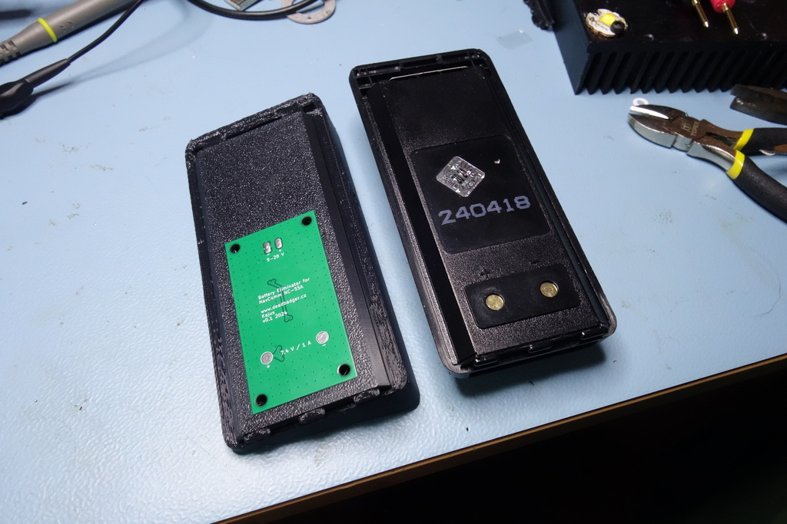

# Battery eliminator for NavComm NC-55A

The aim of this project is to eliminate battery from the [NavComm NC-55A airband](https://navcomm.eu/en/air-band/15-handheld-air-band-radio-with-vor-and-bluetooth-5907662381407.html#/wersje_nc_55a-basic/battery_type-battery_li_po_2400mah)
radio by providing a regulated voltage supply directly through the battery
contacts of the radio.

## Design constraints

- Radio uses 2 cell Li-Ion battery used -> 7.4 V nominal working voltage
- Radio current consumption: 1 A for Tx, 70 mA for Rx per manual
- Input voltage range 8-28 V of aircraft power bus (12 V nominal)
- Good input voltage noise filtering is needed - spikes on engine startup, etc.

## Mechanical design

- The mechanical part (holder) of the project was designed in a way that it can be clicked to the radio back in similar way as the battery
- The holder serves as a battery replacement and in the same time as a mounting point of the radio to the aircraft panel
- A simple connector to accomodate 2 jacks needed by the radio (mic, headphones, PTT) is included in the design files
- Design files can be found in [3d folder](./3d) or on my [Onshape profile](https://cad.onshape.com/documents/5d88d10385b6e47e38e9babd/w/7460efe50eb1ed31b91b954c/e/4510368ee41f3908bf5426d3?renderMode=0&uiState=67194a155a797301722a329e)

## PCB Design

### Input protection

- Polarity protection using **SBR3U40S1F** diode
- Transient protections using **SMDJ28CA** 28V 3kW TVS diode
- Shorts protection using a fuse - assuming 1 A output and 80 % efficiency at minimum working voltage, 1.3 A hold current at 80°C is needed. The **C1Q 1.25** will be used.

### Input filtering

A simple SMD ferrite bead followed by 100 nF and Buck converter input capacitors
provides input filtering to reduce amount of noise going from the DC/DC supply
to the aircraft power bus.

### DC-DC converter

As the voltage difference is quite high (worst case 28 - 7.4 = 20.6 V / 1 A
output), the LDO is not a good choice here, switching supply is needed.

- Buck topology
- ~8-30+ V input voltage range
- more than 1 A output current
- Large output current range (light load mode is possible)

The **AP63200WU-7** was selected as it matches all requirements and
requires a minimum amount of external parts.

- 2 A output current limit
- 3.8 - 32 V input voltage
- 500 kHz switching frequency with spread spectrum to reduce EMI
- integrated MOSFETs
- PFM mode for high efficiency on low output currents
- Overvoltage and overtemperature protection

The feedback voltage reference is 0.8 V, a 75k and 9k1 5% resistors will be used,
giving output voltage (worst case) between 6.77 and 8.09 V which is well within
input voltage range of the radio, a 1 % resistors would be better though.

The inductor will be (assuming 50 % ripple current of 2 A - 1 A):

$$ L = \frac{V_{out}(V_{in}-V_{out})}{V_{in}\Delta I_L f_{sw}} = \frac{7.4 (28-7.4)}{28*1*500000} = 10.9 \mu H $$

The datasheet recommended maximum inductance od 10 $$\mu H$$, so let's stick with
this. The recommended RDC is 100 $m\Omega$ and saturation current 35 % higher than peak one.
The **SRR6028-100Y** was selected.

### Output filtering

Output is fed through a ferrite bead to a parallel combination of small ceramic
capacitor and a large capacitor with higher ESR to provide some dumping.

### Output protection

The output of the switching regulator is separated from radio by a fuse
and a TVS diode to protect the circuit from ESD when radio is not connected.

## Testing

- Measured at 13 V input voltage (usual value when engine is running in 12 V based aircraft power system)
- Radio consumption pulses between 20 and 44 mA in Rx while battery saving is enabled, the coil makes annoying buzzing noise
- With battery saving off -> 44 mA constant current, the coil makes very weak high pitch sound
- With backlight on, consumption is 90 mA, no audible noise from coil
- When transmitting, the consumption is around 700 mA
